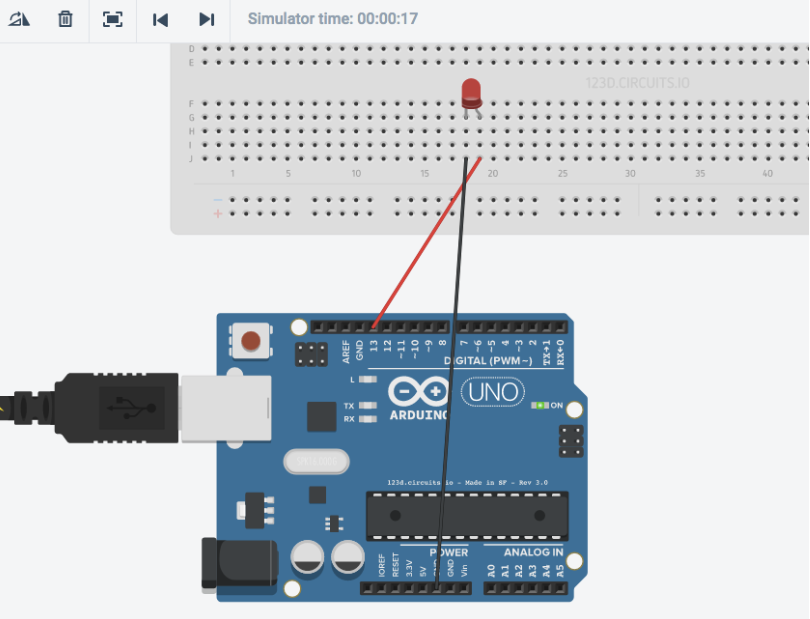
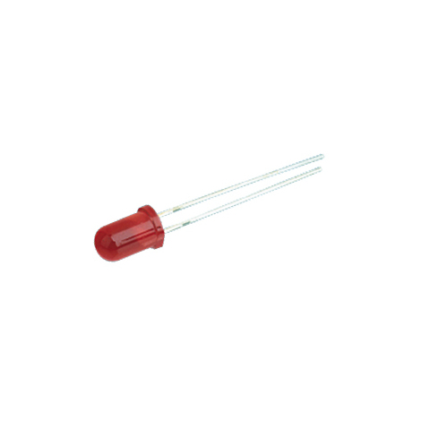
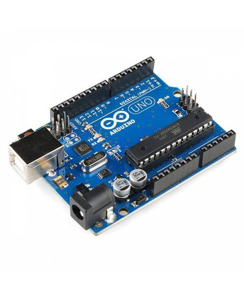

# Práctica 1: Encender y apagar un led

- 1- Registrate en la web [https://www.tinkercad.com/circuits](https://www.tinkercad.com/circuits)  
Esta web te permitirá simular de forma online tus proyectos.

- 2- Crea el siguiente esquema 

Necesitarás añadir los siguientes componentes: 

    > Un led (luz de color rojo)

    Nota:
           La patilla “más” larga es la positiva.
           La patilla “menos” larga es la negativa 

      

    Una protoboard (investiga cómo funcionan las placas protoboards)

 
La Protoboard es una placa de pruebas en los que se pueden insertar elementos electrónicos y cables con los que se arman circuitos sin la necesidad de soldar ninguno de los componentes

    Una placa Arduino (por ejemplo la R3)

## Resumen 
La  __Práctica1__ consiste en encender y apagar un led.  
    _a)_ En primer lugar realizamos el esquema del circuito en Tinkercad.
    
Esto se hará de la siguiente forma:

- Cojemos un arduino, un led de color, una placa de pruebas(protoboard) y entre dos o tres cables machos.
- Conectamos tres extremos de los cables al arduino y los otros tres extremos a la placa de pruebas donde se encuentra el led. (No es necesario conectarlo justo donde está el led, puedes ponerlo en la linea vertical donde pusiste este )
- Introducimos el código para hacer lo que nos pide el ejercicio. (Dependiendo el lugar donde pusieramos los cables el código puede variar)
  
- Iniciamos simulación.
    - En el caso de que ocurra un error habría que revisar el código o ver si tenemos mal conectado algun cable en el circuito.

_b)_ Si todo va bien pasaremos a probarlo en una placa real.
  
- Montamos en la placa real el circuito realizado en Tinkercad 
- Para conectarlo realizamos los siguientes pasos:
    1. Primero descargamos el programa de arduino para poder cargar nuestro código en el sistema.  
            [Aquí](https://www.arduino.cc/en/Main/Software) tienes disponible la página donde puedes descargarlo.  
      

    2. Una vez descargado el programa de arduino, descargaremos los drivers necesarios.  
             __WARNIG__  No todos los arduinos utilizan los mismos drivers ,dependiendo de que arduino utilices cambiará el driver.  
            [Aquí](https://youtu.be/LIWn59qNbRk) te dejo un link a un vídeo donde te explica como instalar driver para un arduino Nano.
        > Nota:  
             Este paso solo lo tendremos que realizar una única vez.   
         

    3. Abrimos el programa. Comprobamos que el puerto este conectado al adecuado, la placa que esté seleccionada en el arduino que estamos utilizando, y lo mismo con el procesador.
    4. Conectamos el arduino al PC. Ponemos el codigo en el programa y le damos a "Subir".
    
COMPLETADO

