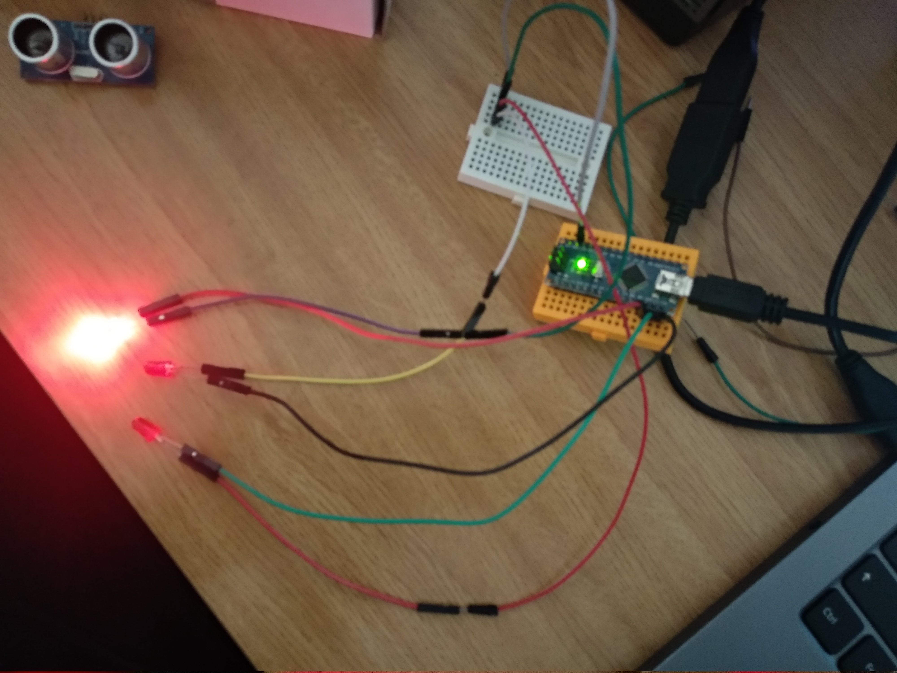

# Práctica 2: Encender y apagar 3 leds de forma consecutiva

- 1- Crea el siguiente esquema 

Necesitarás añadir los siguientes componentes: 

    > tres led (luz de colores)

    Nota:
           La patilla “más” larga es la positiva.
           La patilla “menos” larga es la negativa 

      

    Una protoboard (investiga cómo funcionan las placas protoboards)

 
La Protoboard es una placa de pruebas en los que se pueden insertar elementos electrónicos y cables con los que se arman circuitos sin la necesidad de soldar ninguno de los componentes

    Una placa Arduino (por ejemplo la R3)

## Resumen 
La  __Práctica2__ consiste en encender y apagar 3 leds de forma consecutiva  
    _a)_ Como en el anterior ejercicio realizamos primero el esquema del circuito en Tinkercad.
    
Esto se hará de la siguiente forma:

- Cojemos el material que necesitamos; un arduino, tres ledes de color, una placa de pruebas(protoboard) y  tres cables machos.
- Montamos el circuito
- Introducimos el (codigo) [https://github.com/iago1997/Practicas-Arduino/blob/master/2/practica_2b.io/practica_2.io.ino] para hacer lo que nos pide el ejercicio. (Dependiendo el lugar donde pusieramos los cables el código puede variar)
  
- Iniciamos simulación.
    - En el caso de que ocurra un error habría que revisar el código o ver si tenemos mal conectado algun cable en el circuito.

_b)_ Si todo va bien pasaremos a probarlo en una placa real.

  
- Montamos en la placa real el circuito realizado en Tinkercad 
         
    1. Abrimos el programa. Comprobamos que el puerto este conectado al adecuado, la placa que esté seleccionada en el arduino que estamos utiliando, y lo mismo con el procesador.
    2. Conectamos el arduino al PC. Ponemos el codigo en el programa y le damos a "Subir".
    
COMPLETADO

## Cambios Realizados

  - Que las luces se apaguen y enciendan cada vez más rápido.  
    - Para modificar la velocidad tendremos que cambiar el número de "ms" en la función delay(ms) , donde ms es la cantidad de tiempo a esperar entre cada cambio de led.
  - Que las luces enciendan y apaguen todas la vez. (parpadeando cada 1 segundo) 
    - Pincha [aquí](https://github.com/iago1997/Practicas-Arduino/blob/master/2/practica_2b.io/practica_2b.io.ino) para ver el código.
  
