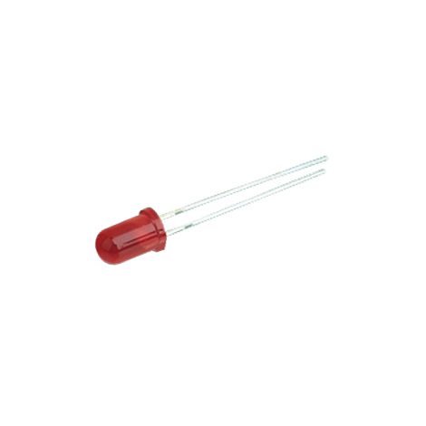

   # Práctica 3: Encender y apagar 4 leds de forma consecutiva con sonido.

- Crea el siguiente esquema 

Necesitarás añadir los siguientes componentes:  

    > 4 ledes (luz de colores)

    Nota:
           La patilla “más” larga es la positiva.
           La patilla “menos” larga es la negativa 

      

  

  

    > Un Buzzer
     Es un transductor electroacústico que produce un sonido o zumbido continuo o intermitente de un mismo tono (generalmente agudo)         

  

  

    > Una placa Arduino (por ejemplo la R3)

  

## Resumen 
La  __Práctica3__ consiste en encender y apagar 4 leds de forma consecutiva con sonido.

   _a)_ Como en los anteriores ejercicios realizamos primero el esquema del circuito en Tinkercad.
    
Esto se hará de la siguiente forma:

- Cojemos el material que necesitamos; un arduino, cuatro ledes de color, una placa de pruebas(opcional), un buzzer y  varios cables hembras y machos.
- Montamos el circuito. Es lo mismo que el anterior ejercicio pero añadiendole un buzzer.
- Introducimos el código para hacer lo que nos pide el ejercicio. (Dependiendo el lugar donde pusieramos los cables el código puede variar)
  
- Iniciamos simulación.
    - En el caso de que ocurra un error habría que revisar el código o ver si tenemos mal conectado algun cable en el circuito.

_b)_ Si todo va bien pasaremos a probarlo en una placa real.

  
- Montamos en la placa real el circuito realizado en Tinkercad 
         
    1. Abrimos el programa. Comprobamos que el puerto este conectado al adecuado, la placa que esté seleccionada en el arduino que estamos utiliando, y lo mismo con el procesador.
    2. Conectamos el arduino al PC. Ponemos el codigo en el programa y le damos a "Subir".
    
COMPLETADO: 

   

  

Pincha [aquí](https://github.com/iago1997/Practicas-Arduino/blob/master/3/VideoPactica3.mp4) para ir al vídeo.

  
