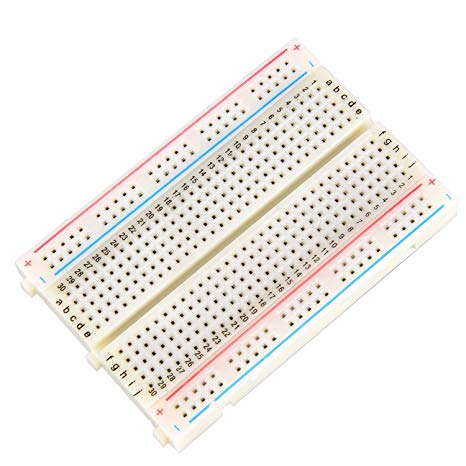

# Práctica 5: Mover un servo motor con el código mejorado

- Crea el siguiente esquema 

Necesitarás añadir los siguientes componentes:  

    > Servo Motor
     Es un dispositivo similar a un motor de corriente continua que tiene la capacidad de ubicarse en cualquier posición dentro de su rango de operación, y mantenerse estable en dicha posición.

      

  

  

    > Una Protoboard
             

  

  

    > Una placa Arduino (por ejemplo la R3)

  

  

    > Un pulsador

  

## Resumen 
La  __Práctica5__ consiste en mover un servo mediante un pulsador.

_a)_ Como en los anteriores ejercicios realizamos primero el esquema del circuito en Tinkercad.
    
Esto se hará de la siguiente forma:

- Cojemos el material que necesitamos; un arduino, un servomotor, una placa de pruebas(opcional) y varios cables hembras y machos.
- Montamos el circuito:
  - Las conexiones dependerán del tipo de servomotor con Arduino que estemos utilizando.
  - Todos deben tener 3 cables. Uno irá a tierra, otro a la alimentación de 5 Voltios y el tercero a un pin PWM.
  - EL pulsador tambien debe estar conectado por tres cables conectados a tierra, a la alimentación de 5 Voltios y      a un pin PWM.    
- Introducimos el [código](https://github.com/iago1997/Practicas-Arduino/blob/master/5/practica_5/practica_5.ino) para hacer lo que nos pide el ejercicio. (Dependiendo del lugar donde pusieramos los cables el código puede variar)
  
- Iniciamos simulación.
    - En el caso de que ocurra un error habría que revisar el código o ver si tenemos mal conectado algun cable en el circuito.

_b)_ Si todo va bien pasaremos a probarlo en una placa real.

  
- Montamos en la placa real el circuito realizado en Tinkercad 
         
    1. Abrimos el programa. Comprobamos que el puerto este conectado al adecuado, la placa que esté seleccionada en el arduino que estamos utiliando, y lo mismo con el procesador.
    2. Conectamos el arduino al PC. Ponemos el codigo en el programa y le damos a "Subir".
    
COMPLETADO

Pincha [aquí](https://github.com/iago1997/Practicas-Arduino/blob/master/5/videoPractica5.e.mp4) para ir al vídeo.
