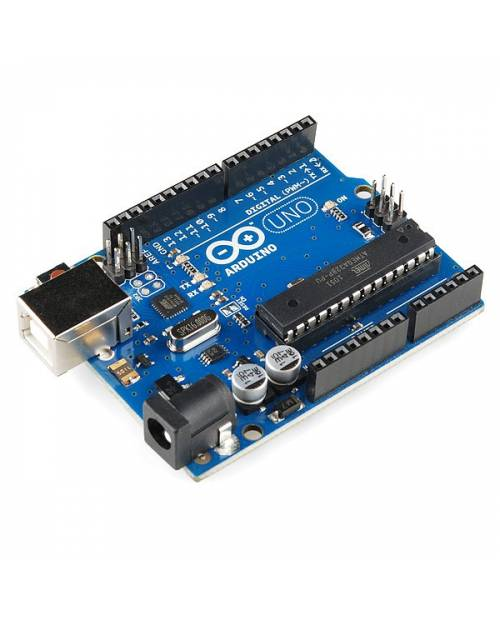

# Práctica 6: Sensor de proximidad.

- Crea el siguiente esquema 

Necesitarás añadir los siguientes componentes:  

    > Sensor de distancia
     Están pensados para realizar la medida de distancia o desplazamiento lineal, de una forma automatizada, ya que proporcionan una señal eléctrica según la variación física, en este caso la variación física es la distancia.

      

  

  

    > Una Protoboard
             

  

  

    > Una placa Arduino (por ejemplo la R3)

  

  

 

## Resumen 
La  __Práctica6__ consiste en que crees un dispositivo (usando el sensor ultrasónico HC-SR04) que cuando un objeto esté a unos 20 centímetros de este, se encienda una luz (led).

_a)_ Como en los anteriores ejercicios realizamos primero el esquema del circuito en Tinkercad.
    
Esto se hará de la siguiente forma:

- Cojemos el material que necesitamos; un arduino, un sensor de distancia, una placa de pruebas(opcional) y varios cables hembras y machos.
- Montamos el circuito:
   
- Introducimos el [código](CodigoPractica4) para hacer lo que nos pide el ejercicio. (Dependiendo del lugar donde pusieramos los cables el código puede variar)
  
- Iniciamos simulación.
    - En el caso de que ocurra un error habría que revisar el código o ver si tenemos mal conectado algun cable en el circuito.

_b)_ Si todo va bien pasaremos a probarlo en una placa real.

  
- Montamos en la placa real el circuito realizado en Tinkercad 
         
    1. Abrimos el programa. Comprobamos que el puerto este conectado al adecuado, la placa que esté seleccionada en el arduino que estamos utiliando, y lo mismo con el procesador.
    2. Conectamos el arduino al PC. Ponemos el codigo en el programa y le damos a "Subir".
    
COMPLETADO

Pincha [aquí]() para ir al vídeo.